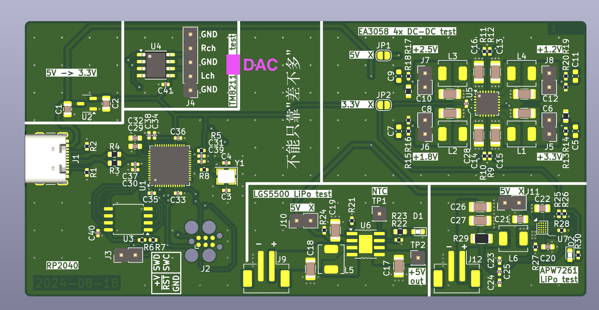

# China / LCSC poorly-documented parts tester PCB

## TM8211

This is a cheap I2S DAC that looks like it is intended for set-top-boxes. Allegedly, there is no minium clock speed. The goal is to determine if this is indeed true, in which case it can be bit-banged instead of doing proper I2S with a continuously-running clock. If it were to be the case, we would want to know the output impedance of the DAC.

### Status

I haven't managed to get this chip to output anything at all so far, even with a continuous clock. Further investigation needed.

## EA3058

This is a 4-channel buck converter. I wanted to characterize its performance in more detail than the few graphs in the datasheet.

### Status

The zero-load performance seems quite poor on the 1.2 V output. Further measurements have not been made yet.

## LGS5500

This is a LiPo charger and boost converter with automagic power path / load sharing. It appears to be perfectly-suited for battery-powered "maker" projects, especially ones that need 5 V and/or want to be able to push batteries to ~3 V rather than ~3.4 V (with an ultra-low-dropout regulator) or even higher voltages (using less and less of the battery capacity). Once again I wanted to characterize the performance in more detail than in the datasheet.

### Status

There is somewhat undesired behavior if there is no battery connected. Automagic power path / load sharing appears to work very well, but more measurements need to be made of whether spikes/dips happen. Needs more testing of the boost converter under load.

## APW7261

This is another LiPo charger and boost converter that is especially cheap. It was a bit unclear how (in)convenient it would be to use. It was also a test of using WLCSPs and pushing JLCPCB minimums.

### Status

This is clearly designed for legacy OTG, and it doesn't have the same type of automagic power path / load sharing as the previous part. It was assembled successfully without any issues.
